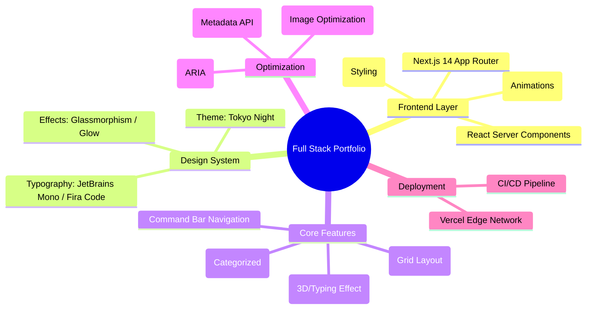

# My Portfolio

## ️ Tech Stack

This project is built on a modern, strictly typed stack:

| Category | Technology | Description |
|----------|------------|-------------|
| **Core** |  | React Framework for Production |
| **Language** |  | Static Typing & Type Safety |
| **Styling** |  | Utility-First CSS Framework |
| **Animation** |  | Production-Ready Animation Library |
| **Hosting** |  | Edge Network Deployment |

---

## 🗺️ Project Architecture (Mindmap)

A visual overview of the project's structure and feature set.



---

## 🚀 Installation & Setup

Follow these steps to run the portfolio locally.

### Prerequisites

- **Node.js** (v18.17.0 or higher)
- **npm** / **yarn** / **pnpm**
- **Git**

### 1. Clone the Repository

```bash
git clone https://github.com/cjohnmizo/myportfolio.git
cd myportfolio
```

### 2. Install Dependencies

Using npm:

```bash
npm install
```

### 3. Configure Environment

Create a `.env.local` file in the root directory if you need specific environment variables (though none are strictly required for the base template).

### 4. Run Development Server

```bash
npm run dev
```

Open [http://localhost:3000](http://localhost:3000) in your browser.

### 5. Production Build

To test the production build locally:

```bash
npm run build
npm start
```

---

## 📂 Project Structure

```bash
.
├── public/                 # Static assets (images, fonts, favicon)
├── src/
│   ├── app/                # Next.js App Router (Pages & Layouts)
│   │   ├── globals.css     # Global Styles (Theme Variables)
│   │   ├── layout.tsx      # Root Layout
│   │   └── page.tsx        # Homepage
│   ├── components/         # Reusable React Components
│   │   ├── Navbar.tsx      # Command Bar Navigation
│   │   ├── Footer.tsx      # Site Footer
│   │   └── ui/             # Atomic UI Elements (Buttons, Cards)
│   ├── data/               # Configuration & Static Data
│   │   └── config.ts       # Site content (Edit this!)
│   └── lib/                # Utility functions & helpers
├── next.config.mjs         # Next.js Configuration
├── tailwind.config.ts      # Tailwind CSS Theme Extension
└── tsconfig.json           # TypeScript Configuration
```

---

## 🛠️ How to Update Content

The entire portfolio is data-driven. You can update **90% of the content** without touching any React code.

### 1. Edit Content (`src/data/config.ts`)
Open `src/data/config.ts` to change:
- **Profile:** Name, role, email, social links.
- **Hero:** Headline, description.
- **About:** Bio text, stats.
- **Skills:** Add/remove skills and change proficiency levels.
- **Projects:** Add new projects (title, description, tags, links).
- **Contact:** Address, availability status.

### 2. Update Images
- Place new images in the `public/` folder.
- Reference them in `config.ts` (e.g., `image: "/new-project.jpg"`).

### 3. Change Colors (Theme)
Edit `src/app/globals.css`:
- **Dark Mode:** Edit variables under `.dark`.
- **Light Mode:** Edit variables under `:root`.

### 4. Deploy Updates
Simply push your changes to GitHub, and Vercel will automatically redeploy:
```bash
git add .
git commit -m "Update portfolio content"
git push
```

---

## 🤝 Contributing

Contributions are welcome! If you'd like to improve this template:

1.  Fork the repository.
2.  Create a feature branch (`git checkout -b feature/AmazingFeature`).
3.  Commit your changes (`git commit -m 'Add some AmazingFeature'`).
4.  Push to the branch (`git push origin feature/AmazingFeature`).
5.  Open a Pull Request.

---

## 📄 License

Distributed under the MIT License. See `LICENSE` for more information.
