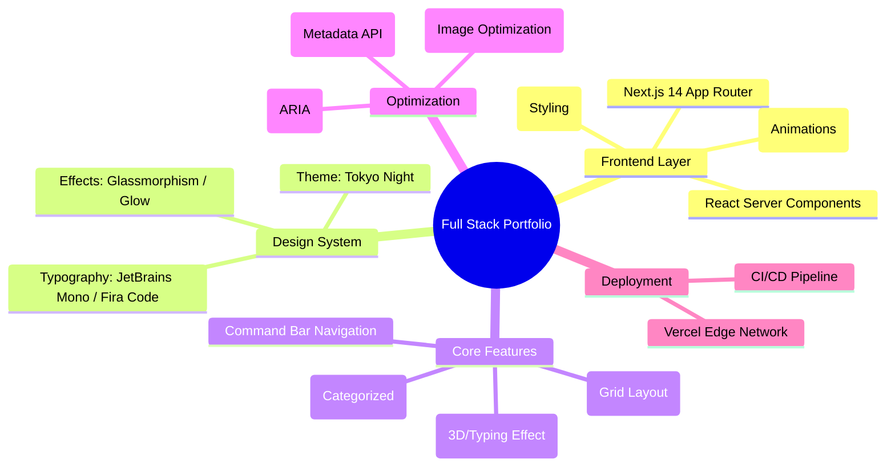

<div align="center">

# ⚡ Tokyo Night Portfolio

### A Modern, Developer-Centric Portfolio Template
*Built with Next.js 14, Framer Motion & Tailwind CSS*

[](https://cjohnmizo.vercel.app)
[](LICENSE)
[](https://github.com/cjohnmizo/myportfolio/actions)


</div>

---

## 📖 Introduction

This is a premium, high-performance portfolio template designed for software engineers who value aesthetics as much as code quality. 

It features a custom **"Tokyo Night" UI Theme**—a deep midnight blue palette with neon accents—paired with a unique **"Command Bar"** navigation system that mimics a terminal interface. The design is fully responsive, SEO-optimized, and built for speed.

### ✨ Key Features

- **🎨 "Tokyo Night" Aesthetic**: Deep Storm backgrounds (`#1a1b26`) with Neon Blue/Purple accents.
- **⌨️ Command Bar Navigation**: Terminal-style sticky navbar (`./Home`, `>_ Contact`).
- **🌑 Dark/Light Mode**: Seamless theme switching with "Glass" effect adaptation.
- **⚡ High Performance**: Powered by Next.js 14 App Router & Server Components.
- **📱 Mobile Terminal**: A fully responsive mobile menu that feels like a CLI.
- **🎭 Micro-Animations**: Smooth, professional motion using Framer Motion.
- **🔍 SEO Ready**: Meta tags, Open Graph, and semantic HTML structure.

---

## 🛠️ Tech Stack

This project is built on a modern, strictly typed stack:

| Category | Technology | Description |
|----------|------------|-------------|
| **Core** |  | React Framework for Production |
| **Language** |  | Static Typing & Type Safety |
| **Styling** |  | Utility-First CSS Framework |
| **Animation** |  | Production-Ready Animation Library |
| **Hosting** |  | Edge Network Deployment |

---

## 🗺️ Project Architecture (Mindmap)

A visual overview of the project's structure and feature set.



---

## 🚀 Installation & Setup

Follow these steps to run the portfolio locally.

### Prerequisites

- **Node.js** (v18.17.0 or higher)
- **npm** / **yarn** / **pnpm**
- **Git**

### 1. Clone the Repository

```bash
git clone https://github.com/cjohnmizo/myportfolio.git
cd myportfolio
```

### 2. Install Dependencies

Using npm:

```bash
npm install
```

### 3. Configure Environment

Create a `.env.local` file in the root directory if you need specific environment variables (though none are strictly required for the base template).

### 4. Run Development Server

```bash
npm run dev
```

Open [http://localhost:3000](http://localhost:3000) in your browser.

### 5. Production Build

To test the production build locally:

```bash
npm run build
npm start
```

---

## 📂 Project Structure

```bash
.
├── public/                 # Static assets (images, fonts, favicon)
├── src/
│   ├── app/                # Next.js App Router (Pages & Layouts)
│   │   ├── globals.css     # Global Styles (Theme Variables)
│   │   ├── layout.tsx      # Root Layout
│   │   └── page.tsx        # Homepage
│   ├── components/         # Reusable React Components
│   │   ├── Navbar.tsx      # Command Bar Navigation
│   │   ├── Footer.tsx      # Site Footer
│   │   └── ui/             # Atomic UI Elements (Buttons, Cards)
│   ├── data/               # Configuration & Static Data
│   │   └── config.ts       # Site content (Edit this!)
│   └── lib/                # Utility functions & helpers
├── next.config.mjs         # Next.js Configuration
├── tailwind.config.ts      # Tailwind CSS Theme Extension
└── tsconfig.json           # TypeScript Configuration
```

---

## ⚙️ Customization

Most content can be edited directly in `src/data/config.ts`.

```typescript
// Example: src/data/config.ts
export const config = {
  profile: {
    name: "Your Name",
    role: "Full Stack Developer",
    // ...
  },
  socials: {
    github: "https://github.com/yourusername",
    linkedin: "https://linkedin.com/in/yourusername",
  },
  // ...
};
```

### Changing Colors

To modify the theme colors, edit `src/app/globals.css`. Look for the `:root` and `.dark` blocks to adjust CSS variables like `--bg`, `--accent`, etc.

---

## 🤝 Contributing

Contributions are welcome! If you'd like to improve this template:

1.  Fork the repository.
2.  Create a feature branch (`git checkout -b feature/AmazingFeature`).
3.  Commit your changes (`git commit -m 'Add some AmazingFeature'`).
4.  Push to the branch (`git push origin feature/AmazingFeature`).
5.  Open a Pull Request.

---

## 📄 License

Distributed under the MIT License. See `LICENSE` for more information.

---

<div align="center">

*Designed & Developed by [C. John Remthang](https://github.com/cjohnmizo)*

</div>
